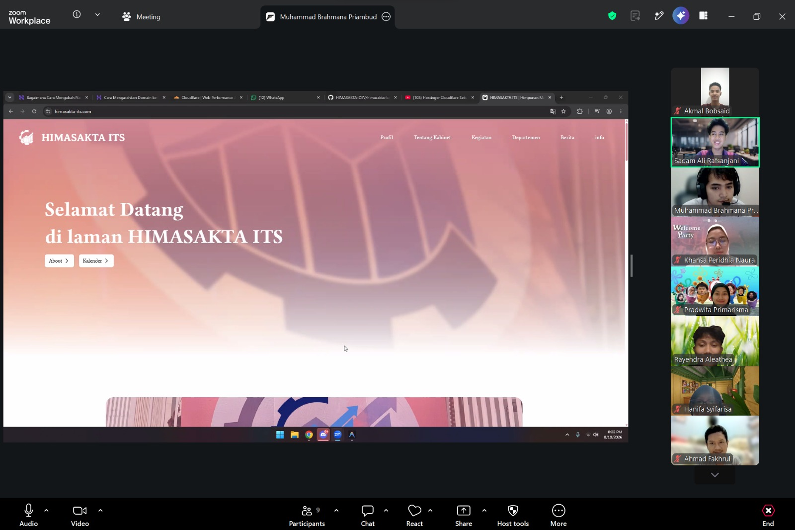

# Fakhrul's Complete Front-End Dcoumentation

A complete documentation of my front-end software development app. This is perfect place to learn front-end development together (not completely basic, mostly advanced concepts and technical development problem). Feel free to contribute every development problem you could solve so we can learn together 😉. I promise to myself to not publish this repo until I reach decent amount of documentation.

## Background Stories

Some of my stories learning this stuff. Hope this will inspire you.

### 1. How I got myself to web2 FE development

In late January 2026 I took a bootcamp from my campus. That bootcamp final project was to built a full stack website MVP for HIMASAKTA ITS using NextJS 14 And Go Gin. I started creating it as leader in FE developer in late February 2026 with almost 0 experience with NextJS or ReactJS (I don't care if you believe it or not). But thankfully with a lot of support from my friend [brahmana](https://github.com/fastering18) it finally working out pretty good. I literally built it only with some knowledge in this [video](https://youtu.be/tI_Nt32_4wM?si=KZLZoiwty4h25FPb). Yeah that video very briefly taught me how complete Next JS can be both FE+BE like PHP but different flavour instead of plain client side Front-end react framework. And now it's done in late April 2026 (yes, only 1 and half month). I working on it about 5-8 hours a day, sometimes 3-4 hours not fully vibe coding, just spilling massive prompt to ChatGPT and Gemini lol. Now it's fully published in at August 10th, 2026 [here](https://himasakta-its.com). And that's how I got myself obsessed to React+NextJS until now (6 months+ by the time I write this).

  

## Enough Yapping Let's Study Now

To get to the same page make sure you already install the prerequisites. I will briefly explain it to each topics. So yeah go check the folder. 
One more, so that I don't repeat myself, please install Git and Create Github account first.

- Learn NextJS: [here](./web2/nextjs/)

---

Created with 💖 by Ahmad Fakrhul Bawani
